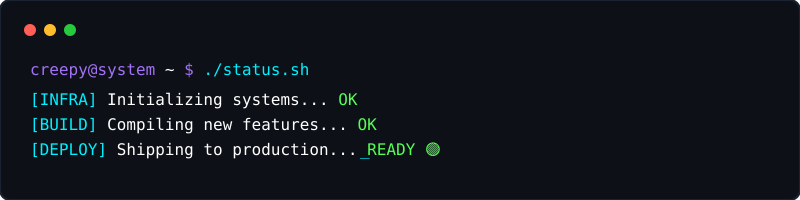

  

<h1 align="center">CREEPY</h1>

**FULL-STACK ENGINEER &middot; TOOLS & AUTOMATION &middot; INFRASTRUCTURE**

 

  

I build high-performance systems, automated tooling, and structured digital architectures.  
Focused on scalable backends, deployment automation, and building things that actually work.

  

  

  

### 🟢 CURRENTLY BUILDING & INVESTIGATING

<table>
  <tr>
    <td align="center" width="50%">
      <b>AUTOMATION & DEVOPS</b> 
      Exploring seamless deployment pipelines and service persistence tools.
    </td>
    <td align="center" width="50%">
      <b>GAME SERVER INFRASTRUCTURE</b> 
      Developing robust configuration architectures for isolated application hosting.
    </td>
  </tr>
</table>

  

  

### ⚡ FEATURED PROJECTS

 

#### 01 / DISCORD-ONLINE-FOREVER

**Persistent Connection & Automation**
> An automated connectivity utility designed to maintain perpetual presence on Discord. Built for robust long-term execution and persistent network state maintenance without dropping connections.

**Tech:** `Automation` `Network Protocols` `Persistence` 
[View Repository](https://github.com/xCreepy/Discord-Online-Forever)

  

#### 02 / PTERODACTYL EGGS

**Infrastructure-as-Code & Server Provisioning**
> Custom service eggs for the Pterodactyl panel ecosystem. Highly structured JSON configurations that define environments, startup scripts, and dependencies for seamless deployment of isolated game and application servers.

**Tech:** `JSON` `Bash` `Docker` `Infrastructure`
[View Repository](https://github.com/xCreepy/eggs)

  

  

### ⚙️ ENGINEERING WORKFLOW

 

  

  

### 🧬 TECHNOLOGY DNA

<table>
  <tr>
    <td align="right"><b>LANGUAGES</b></td>
    <td><code>JavaScript</code> <code>TypeScript</code> <code>Python</code> <code>Go</code></td>
  </tr>
  <tr>
    <td align="right"><b>FRONTEND & BACKEND</b></td>
    <td><code>React</code> <code>Next.js</code> <code>Node.js</code></td>
  </tr>
  <tr>
    <td align="right"><b>INFRASTRUCTURE</b></td>
    <td><code>Docker</code> <code>Linux</code> <code>PostgreSQL</code></td>
  </tr>
  <tr>
    <td align="right"><b>AUTOMATION</b></td>
    <td><code>Scripting</code> <code>CI/CD Pipelines</code></td>
  </tr>
</table>

  

  

### 📊 SYSTEM TELEMETRY

&nbsp;&nbsp;

  

  
  

  

